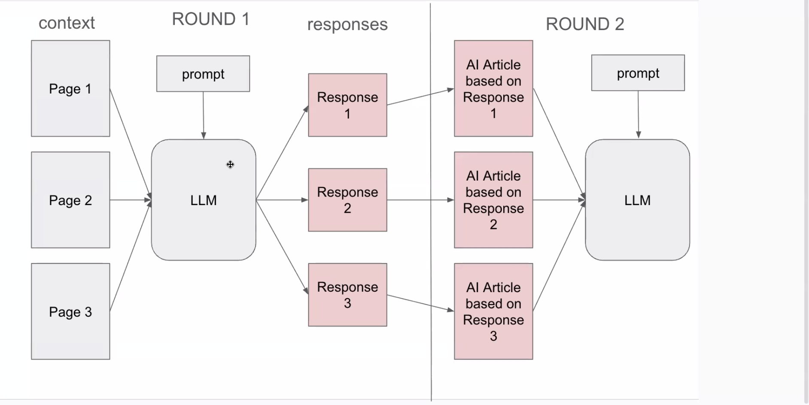

# RAG-Collapsement-on-Self-Refined-Generation

## Setup

### Use Conda
1. Create a conda virtual environment:
   ```bash
   module load conda/latest
   conda create -n ragenv python=3.11
   conda activate ragenv
   ```
2. Install dependencies:
   ```bash
   pip install -r requirements.txt
   ```
## Running Examples

### LLM Service Examples
The `llm_service` directory contains example files demonstrating how to use the custom LLM and embedding models.

#### Running inference_example.py
This example demonstrates:
- Batch chat inference via the vLLM server
- Text embeddings and similarity calculations

Requires a running vLLM server. Start it first (see [Step 1 — Start the vLLM Server](#step-1--start-the-vllm-server)), then:

```bash
export VLLM_API_BASE="http://<fqdn>:5150/v1"
python llm_service/inference_example.py
```

## Pipeline details

The pipeline studies **RAG collapse**: the model answers from retrieved context, then its answers are turned into "documents" and fed back as context for the next round.

We support three **document-setting variants** (set via `--pipeline-variant`):

- **Replace All** (`hybrid` with `--num-synth-docs 10 --num-db-docs 0`): Each round the model sees only *synthetic* docs (from its own prior outputs, expanded into web-style articles via a dedicated prompt). Round 0 uses the question's references; from round 1 onward context is 10 synthetic docs. **10 rounds.**
- **Replace One** (`replace_one`): Start with the question's references (up to 10). Each round, replace exactly one slot in that list with one new AI-generated doc; the list evolves over **20 rounds.**
- **Search** (`search`): Each round the model sees the top-k chunks from a vector store (chunked docs, embedded with SentenceTransformer by default). New generated docs are added to the store each round. **30 rounds.**
- **Agentic RAG** (`agentic_rag`): Same as search — vector store seeded from references, new AI-generated docs added each round — but instead of pre-fetching top-k into the prompt, the model is given a `retrieve(query)` tool and decides what to search on its own. **30 rounds.**

**Feedback step:** Each answer is passed through a "create document" prompt (see `formatters.py`) so the model produces a full web-style article; that text becomes the synthetic document(s) for the next iteration.

**Outputs:** One JSON file per run (e.g. `local_replace_all.json`, `local_replace_one.json`, `local_search.json`) with `experiment_metadata`, `questions`, and per-iteration `documents` and `runs`.

## Running the Pipeline

There are three model modes:
- **`--model-mode server`** (recommended): HTTP client to a running vLLM OpenAI-compatible server. Pass `--vllm-api-base <url>` or export `VLLM_API_BASE`. No GPU needed in the pipeline process itself.
- **`--model-mode local`**: loads the model in-process via vLLM. Requires a GPU allocation in the pipeline job itself; no separate server needed.
- **`--model-mode api`**: calls a proprietary API (e.g. GPT-4) via LiteLLM. Set `API_KEY` in the environment.

For `server` mode, start the vLLM server and export its URL as `VLLM_API_BASE` before running any script that uses an LLM (`pipeline.py`, `evaluation.py`, `entity_extraction.py`, `llm_service/inference_example.py`).

### Step 1 — Start the vLLM Server

**On HPC (start in a separate terminal or job):**

```bash
vllm serve <model-path-or-name> \
  --served-model-name qwen2.5-14b \
  --tensor-parallel-size 2 \
  --port 5150 \
  --host 0.0.0.0
```

Once the server is ready (look for `"Uvicorn running"` in the output), export its URL:

```bash
export VLLM_API_BASE="http://<fqdn>:5150/v1"
# e.g. export VLLM_API_BASE="http://gypsum-gpu188.unity.rc.umass.edu:5150/v1"
```

**Locally (single machine):**

```bash
vllm serve <model-path-or-name> \
  --served-model-name qwen2.5-14b \
  --tensor-parallel-size 1 \
  --port 5150 \
  --host 0.0.0.0
```

Then in a second terminal:

```bash
export VLLM_API_BASE="http://localhost:5150/v1"
```

### Step 2 — Run the Pipeline

With `VLLM_API_BASE` set, run the pipeline directly:

**Server mode (recommended)** — HTTP client to the running vLLM server, no GPU needed in this process:
```bash
mkdir -p experiment_outputs

python -u pipeline.py \
  --model-mode server \
  --vllm-api-base "$VLLM_API_BASE" \
  --model-name qwen2.5-14b \
  --dataset-path datasets/umass_data.entity.chatgpt.50.jsonl \
  --output-path experiment_outputs/output.json \
  --pipeline-variant hybrid --num-synth-docs 10 --num-db-docs 0 \
  --max-questions 8 \
  --num-runs 10 \
  --chars-per-doc 400
```

**Local mode (alternative)** — loads the model in-process; requires a GPU and no separate server:
```bash
python -u pipeline.py \
  --model-mode local \
  --model-name Qwen/Qwen2.5-14B-Instruct \
  --tensor-parallel-size 2 \
  --dataset-path datasets/umass_data.entity.chatgpt.50.jsonl \
  --output-path experiment_outputs/output.json \
  --pipeline-variant hybrid --num-synth-docs 10 --num-db-docs 0 \
  --max-questions 8 \
  --num-runs 10 \
  --chars-per-doc 400
```

**Pipeline Parameters:**
- `--model-mode`: `server` (HTTP client to vLLM server, pass `--vllm-api-base`), `local` (in-process vLLM, requires GPU), or `api` (e.g. GPT-4 via LiteLLM proxy)
- `--vllm-api-base`: vLLM server URL — required for `server` mode (e.g. `http://host:5150/v1`). Ignored for `local` and `api`.
- `--model-name`: Model identifier; for `server` mode the served model name is auto-discovered from the server
- `--dataset-path`: Input dataset (JSONL)
- `--output-path`: Where to save experiment results
- `--pipeline-variant`: **`hybrid`** (Replace All when used with 10 synth / 0 db), **`replace_one`** (one slot replaced per round), or **`search`**
- **Replace All** (hybrid, 10 rounds): use `--pipeline-variant hybrid --num-synth-docs 10 --num-db-docs 0`. Context each round = synthetic docs only.
- **Replace One** (20 rounds): use `--pipeline-variant replace_one`. Start with refs (up to 10); each round one slot is replaced with one new AI doc. Optional: `--stop-if-converged` to stop early when answers are stable for 4 consecutive rounds.
- **Search** (30 rounds): use `--pipeline-variant search`. Vector retrieval each round; embeddings default to **local** (SentenceTransformer, no API key). Use `--search-embedding-mode api` only if your API exposes embedding models.
- `--max-questions`: Limit number of questions (omit for all)
- `--max-iterations`: Cap on rounds for quick tests (e.g. `--max-iterations 2`)
- `--num-runs`: Responses per round (default 10)
- `--chars-per-doc`: Character limit per document
- `--enable-citations`: Enable citation generation. Omit to disable citations.
- `--doc-model-mode`: Optional. Route document generation (the expand-to-article step) to a separate model. Same choices as `--model-mode`. Omit to reuse the main model. When `server`, also pass `--doc-vllm-api-base`. Optional overrides: `--doc-model-name`, `--doc-temperature`, `--doc-max-tokens`, `--doc-top-p`.
- `--paraphrase-reference-docs`: Rewrite human-authored reference docs through the document-creation prompt before iteration 0, normalizing surface style between human and AI-generated docs.
- `--search-embedding-mode`: `local` (SentenceTransformer, no API key) or `api` (LiteLLM). Used only with `--pipeline-variant search`.
- `--search-embedding-model`: Embedding model name. For `local` mode: a SentenceTransformer name (default: `all-MiniLM-L6-v2`); for `api` mode: a LiteLLM model name.
- `--search-top-k`: Number of top chunks retrieved per round in the search variant (default: `10`).
- `--search-chunk-size`: Character size of each text chunk when indexing documents in the search variant (default: `500`).
- `--search-chunk-overlap`: Character overlap between consecutive chunks in the search variant (default: `50`).
- `--agentic-max-tool-calls`: Max retrieve tool calls per answer in `agentic_rag` variant (default: `10`). The model can call `retrieve` up to this many times before being forced to produce a final answer.

> **Note:** The vLLM server must be started with `--enable-auto-tool-choice --tool-call-parser hermes` for the `agentic_rag` variant to work (Qwen2.5 family). See `scripts/start_llm_server.sh` for details and alternative parsers for other model families.

### Quick smoke test (1 question, 2 rounds)

**Server mode** (requires `VLLM_API_BASE` set):
```bash
mkdir -p experiment_outputs

# Replace All
python -u pipeline.py --model-mode server --vllm-api-base "$VLLM_API_BASE" --model-name qwen2.5-14b \
  --pipeline-variant hybrid --num-synth-docs 10 --num-db-docs 0 \
  --dataset-path datasets/umass_data.entity.chatgpt.50.jsonl \
  --output-path experiment_outputs/test_replace_all.json --max-questions 1 --max-iterations 2

# Replace One
python -u pipeline.py --model-mode server --vllm-api-base "$VLLM_API_BASE" --model-name qwen2.5-14b \
  --pipeline-variant replace_one \
  --dataset-path datasets/umass_data.entity.chatgpt.50.jsonl \
  --output-path experiment_outputs/test_replace_one.json --max-questions 1 --max-iterations 2

# Search (local SentenceTransformer embeddings; no API key needed)
python -u pipeline.py --model-mode server --vllm-api-base "$VLLM_API_BASE" --model-name qwen2.5-14b \
  --pipeline-variant search --dataset-path datasets/umass_data.entity.chatgpt.50.jsonl \
  --output-path experiment_outputs/test_search.json --max-questions 1 --max-iterations 2

# Agentic RAG (requires --enable-auto-tool-choice --tool-call-parser hermes on the server)
python -u pipeline.py --model-mode server --vllm-api-base "$VLLM_API_BASE" --model-name qwen2.5-14b \
  --pipeline-variant agentic_rag --dataset-path datasets/umass_data.entity.chatgpt.50.jsonl \
  --output-path experiment_outputs/test_agentic_rag.json --max-questions 1 --max-iterations 2
```

**Local mode** (no server needed; requires GPU):
```bash
# Replace All
python -u pipeline.py --model-mode local --model-name Qwen/Qwen2.5-14B-Instruct \
  --tensor-parallel-size 2 --pipeline-variant hybrid --num-synth-docs 10 --num-db-docs 0 \
  --dataset-path datasets/umass_data.entity.chatgpt.50.jsonl \
  --output-path experiment_outputs/test_replace_all.json --max-questions 1 --max-iterations 2

# Replace One
python -u pipeline.py --model-mode local --model-name Qwen/Qwen2.5-14B-Instruct \
  --tensor-parallel-size 2 --pipeline-variant replace_one \
  --dataset-path datasets/umass_data.entity.chatgpt.50.jsonl \
  --output-path experiment_outputs/test_replace_one.json --max-questions 1 --max-iterations 2

# Search
python -u pipeline.py --model-mode local --model-name Qwen/Qwen2.5-14B-Instruct \
  --tensor-parallel-size 2 --pipeline-variant search \
  --dataset-path datasets/umass_data.entity.chatgpt.50.jsonl \
  --output-path experiment_outputs/test_search.json --max-questions 1 --max-iterations 2
```

### Running on SLURM/HPC Clusters

The repository includes SLURM batch scripts in the [scripts/](scripts/) directory.

#### Prerequisites
```bash
mkdir -p logs
```

#### 1. Running the Pipeline ([pipeline.sh](scripts/pipeline.sh))

The script uses **server mode** by default. First start a vLLM server (see [Step 1](#step-1--start-the-vllm-server)), export `VLLM_API_BASE`, then:

```bash
sbatch --export=ALL scripts/pipeline.sh
```

`--export=ALL` forwards your current environment (including `VLLM_API_BASE`) into the job. The script runs the active variants and writes, for example:
- `experiment_outputs/Qwen/Qwen2.5-14B-Instruct/local_replace_all.json`
- `experiment_outputs/Qwen/Qwen2.5-14B-Instruct/local_replace_one.json`
- `experiment_outputs/Qwen/Qwen2.5-14B-Instruct/local_search.json`

To use **local mode** instead: in `scripts/pipeline.sh`, comment out the "Server mode" block and uncomment the "Local mode" block. Update `--gres=gpu:2` and memory accordingly.

To use **API mode**: comment out the "Server mode" block and uncomment the "API mode" block; set `API_KEY` in your environment.

**Script variables (edit at top of pipeline.sh):**
- `DATASET` – input JSONL path (default: `datasets/umass_data.entity.chatgpt.400.jsonl`)
- `MODEL` – model identifier (default: `Qwen/Qwen2.5-14B-Instruct`); also used as the output subdirectory
- `OUTDIR` – resolved output directory (`/work/.../experiment_outputs/$MODEL`)
- `EXTRA` – e.g. `--max-questions 400`; add `--max-iterations 2` for shorter test runs

**Switching modes in the script:** the script uses `run_server` (HTTP client, recommended) by default. To switch to `run_local` (in-process vLLM, no separate server), uncomment the `run_local` function and calls, comment out the `run_server` calls, and update the SLURM headers to `--gres=gpu:2` with a matching `--constraint`.

**SLURM Resources:**
- Job name: `pipeline`
- Time limit: 48 hours
- Partition: `gpu`
- GPUs: 1 — constraint `vram40|vram48|vram80`
- Memory: 48 GB
- CPUs: 4

#### 2. Running Inference Examples ([inference.sh](scripts/inference.sh))

Test the LLM service with:
```bash
sbatch scripts/inference.sh
```

This script:
- Runs the inference example from `llm_service/inference_example.py`
- Loads CUDA 12.6 module
- Uses 24GB memory with 1 GPU
- Demonstrates batch inference, embeddings, and similarity calculations

**Note:** The script includes `nvidia-smi` for GPU diagnostics and sets `PYTORCH_CUDA_ALLOC_CONF=expandable_segments:True` for better memory management.

#### 3. Running Evaluation ([eval.sh](scripts/eval.sh))

After pipeline completion:

```bash
sbatch scripts/eval.sh
```

This script:
- Takes experiment outputs and generates evaluation metrics
- Can iterate over one or more Qwen models (e.g. `Qwen/Qwen2.5-7B-Instruct`, `Qwen/Qwen2.5-14B-Instruct`) depending on what is listed in `MODEL_SUBDIRS` in `scripts/eval.sh`.
- For each model subdirectory under `experiment_outputs/`, it reads:
  - `local_search.json`
  - `local_replace_one.json`
  - `local_replace_all.json`
  and writes the corresponding:
  - `local_search_eval.json`
  - `local_replace_one_eval.json`
  - `local_replace_all_eval.json`
    under `evaluation_outputs/Qwen/<model-subdir>/`.

You can edit `scripts/eval.sh` to change which model subdirectories are evaluated.

#### 4. Switching Models

To run the full pipeline (experiments → evaluation) with a **different model**, update these places:

- **Pipeline experiments (`scripts/pipeline.sh`)**
  - `MODEL`: set to the new HF model id, e.g. `Qwen/Qwen2.5-14B-Instruct`.
  - Since `OUTDIR` is derived from `$MODEL`, output will automatically go to a matching subdirectory.
  - This will write experiment JSONs to `experiment_outputs/$MODEL/` with filenames:
    - `local_search.json`
    - `local_replace_one.json`
    - `local_replace_all.json`.

- **Evaluation (`scripts/eval.sh`)**
  - `MODEL_SUBDIRS`: array of model-specific subdirectories under `experiment_outputs/` and `evaluation_outputs/`, e.g.:
    - `Qwen/Qwen2.5-7B-Instruct`
    - `Qwen/Qwen2.5-14B-Instruct`
    - `# "Qwen/Qwen2.5-1.5B-Instruct"` (commented out).
  - For each entry, `eval.sh` expects the three experiment files above and writes:
    - `local_search_eval.json`
    - `local_replace_one_eval.json`
    - `local_replace_all_eval.json`
    into `evaluation_outputs/<MODEL_SUBDIR>/`.

- **Same-answer judge model (optional, `evaluation.py`)**
  - `SAME_ANSWER_MODEL_NAME`: controls which model is used to judge whether two answers are the "same".
  - If you change this, new evaluation runs will record the new value in `measurement_metadata.same_answer_judge_model_name`.

#### Monitoring SLURM Jobs

```bash
# Check job status
squeue --me

# Stream logs
tail -f logs/pipeline_<JOB_ID>.out                   # pipeline
tail -f logs/evaluation_<JOB_ID>.out                 # evaluation
tail -f logs/inference_<JOB_ID>.out                  # inference example

# Cancel a job
scancel <JOB_ID>
```

## Example Experiment Pipeline

