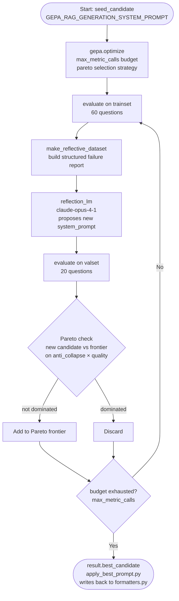
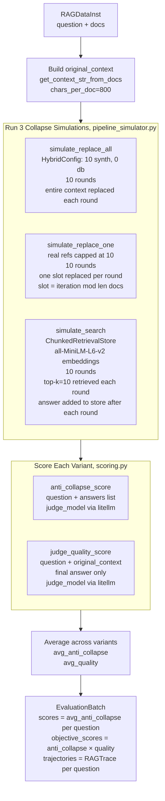
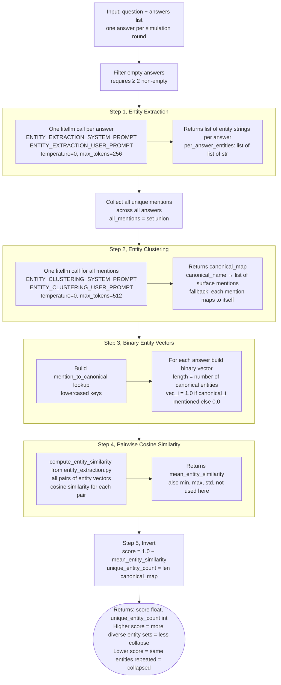
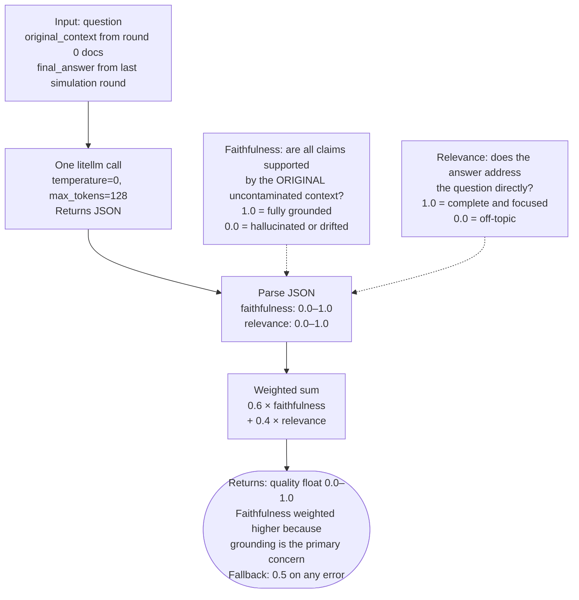
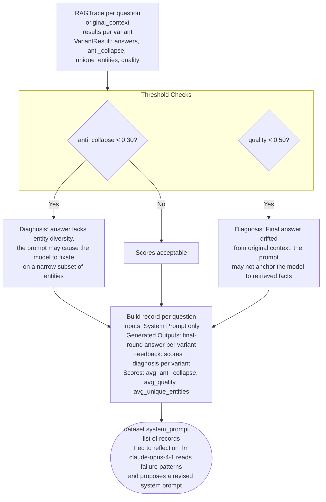
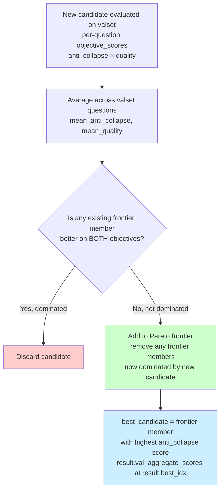

# GEPA Prompt Optimization: Architecture and Metrics

## High-Level Loop



---

## evaluate(): Per Question



---

## Collapse Simulations: Round-by-Round

```mermaid
flowchart TD
    subgraph RA [replace_all, fastest collapse]
        RA0[Round 0: original refs as context] --> RAG0[LLM generates answer_0]
        RAG0 --> RA1[Round 1: answer_0 becomes ALL 10 docs]
        RA1 --> RAG1[LLM generates answer_1]
        RAG1 --> RA2[Round N: answer_{N-1} becomes ALL 10 docs\n...]
    end

    subgraph RO [replace_one, slow decay]
        RO0[Round 0: original refs as context up to 10] --> ROG0[LLM generates answer_0]
        ROG0 --> RO1[Round 1: slot 1 mod len replaced by answer_0]
        RO1 --> ROG1[LLM generates answer_1]
        ROG1 --> RO2[Round N: slot N mod len replaced by answer_{N-1}\noriginal refs decay out one slot at a time]
    end

    subgraph SE [search, retrieval contamination]
        SE0[Seed store with original refs] --> SEQ0[Retrieve top-10 by cosine similarity]
        SEQ0 --> SEG0[LLM generates answer_0]
        SEG0 --> SEA0[Add answer_0 to store]
        SEA0 --> SEQ1[Retrieve top-10, AI text now competes\nwith original refs for top slots]
        SEQ1 --> SEG1[LLM generates answer_1\n...]
    end
```

---

## anti_collapse_score: Step by Step



---

## judge_quality_score: Step by Step



---

## make_reflective_dataset: Feedback to Reflection LM



---

## Pareto Frontier: Candidate Selection



---

## Metrics Summary

| Metric | Range | Computed In | Meaning |
|---|---|---|---|
| `anti_collapse` | 0–1 | `scoring.py` | `1 − mean_entity_similarity` across rounds. **Higher = less collapse.** |
| `unique_entities` | 0–N | `scoring.py` | Total canonical entities mentioned across all rounds. **Higher = more diverse content.** |
| `quality` | 0–1 | `scoring.py` | `0.6 × faithfulness + 0.4 × relevance` vs original context. **Higher = better grounded.** |
| `avg_anti_collapse` | 0–1 | `rag_adapter.py` | Mean `anti_collapse` across 3 variants. **GEPA's primary sort key.** |
| `avg_quality` | 0–1 | `rag_adapter.py` | Mean `quality` across 3 variants. **GEPA's secondary Pareto axis.** |
| `avg_unique_entities` | 0–N | `rag_adapter.py` | Mean `unique_entities` across 3 variants. **Logged in reflective dataset, not a Pareto axis.** |
| `mean_entity_similarity` | 0–1 | `entity_extraction.py` | Average pairwise cosine similarity of binary entity-mention vectors. **Input to anti_collapse.** |

### Collapse Threshold Flags (in reflective dataset diagnosis)

| Flag | Condition | Diagnosis text |
|---|---|---|
| Entity collapse | `anti_collapse < 0.30` | "The answer lacks entity diversity … the prompt may cause the model to fixate on a narrow subset of entities …" |
| Context drift | `quality < 0.50` | "Final answer drifted from original context … the prompt may not anchor the model to retrieved facts." |

---

## Model Roles

| Model env var | Default | Role |
|---|---|---|
| `TASK_MODEL` | `openai/claude-haiku-4-5` | Intended to run the RAG generation under the candidate prompt (see note) |
| `DOC_GEN_MODEL` | `openai/gemma-3-12b-it` | Generates AI contamination documents, and currently also runs generation (see note) |
| `JUDGE_MODEL` | `openai/gpt4o` | Entity extraction, entity clustering, quality judging |
| `REFLECTION_MODEL` | `openai/claude-opus-4-1` | Reads failure reports and proposes a new system prompt |
| `EMBED_MODEL` | `all-MiniLM-L6-v2` | Local SentenceTransformer for `simulate_search` ChunkedRetrievalStore |

> **Note:** `evaluate()` currently passes `doc_gen_llm` into all three simulators, so the candidate prompt is executed by `DOC_GEN_MODEL`; the `task_llm` built from `TASK_MODEL` is presently unused. See `gepa_prompt_optimization_plan.md` → *Results / caveats*.
