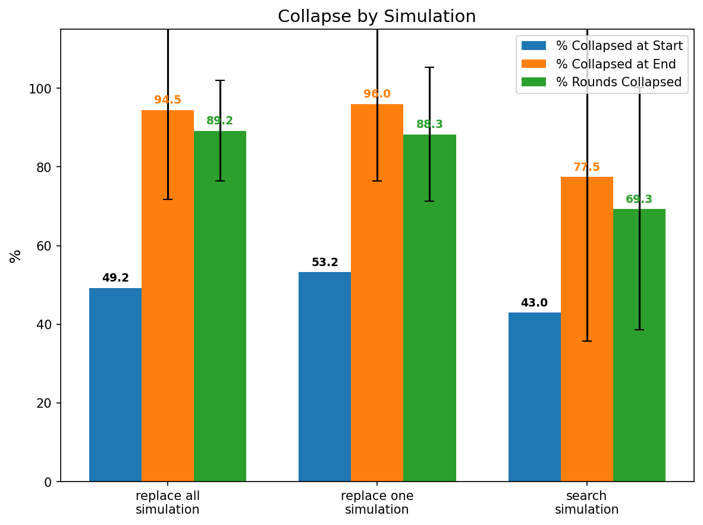
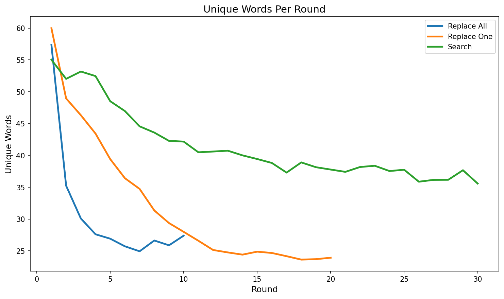
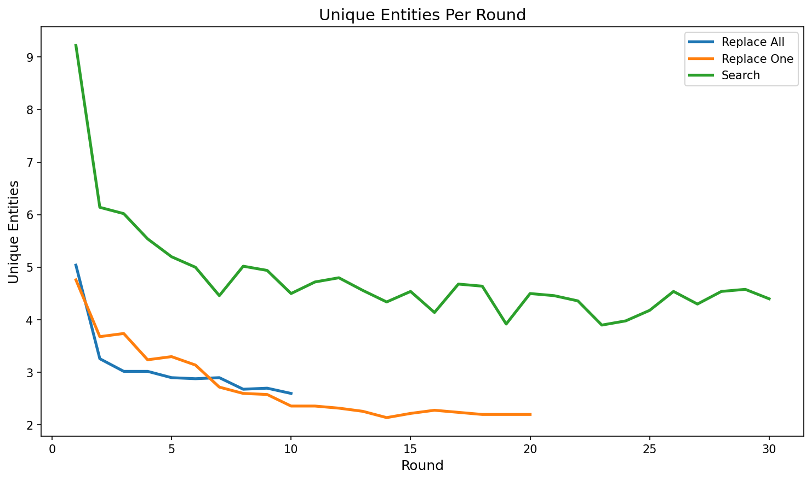
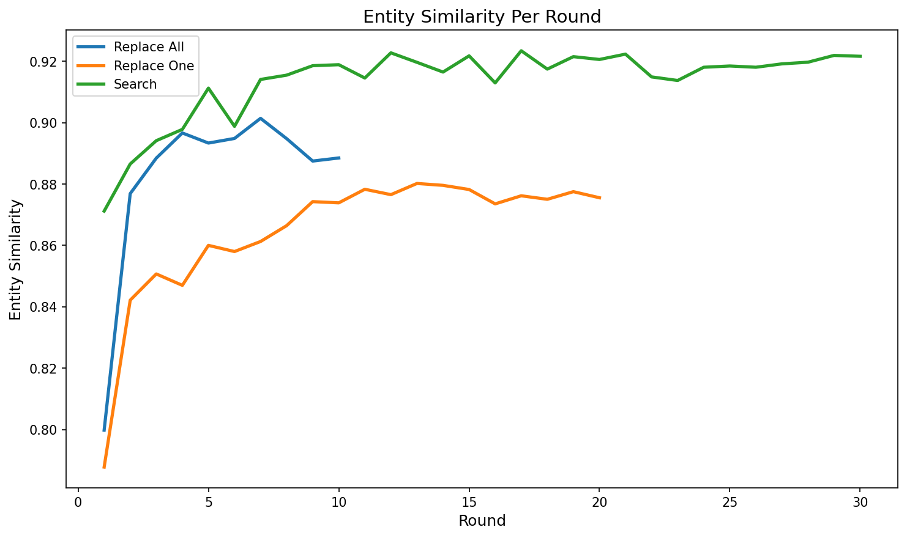
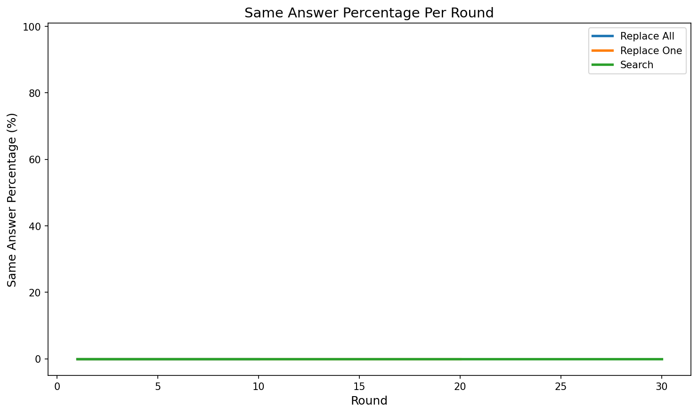
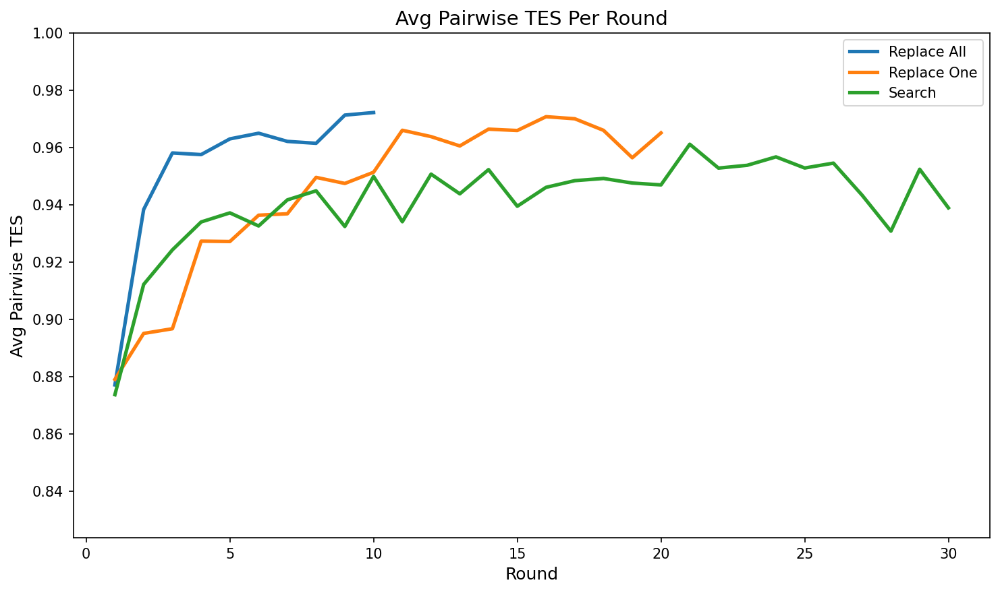
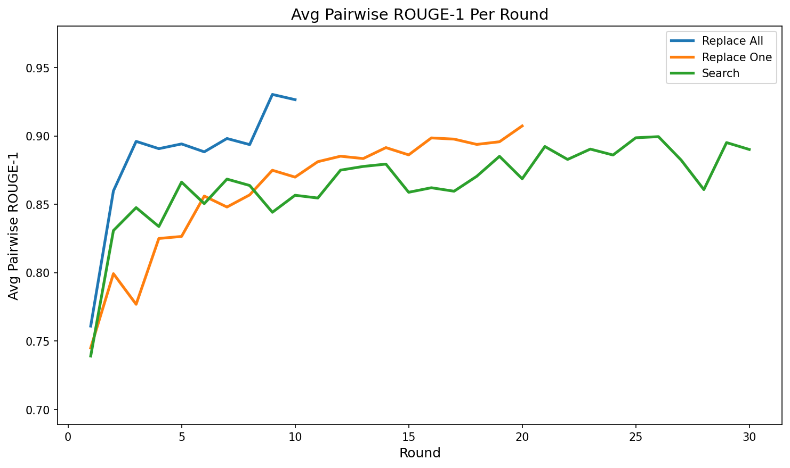
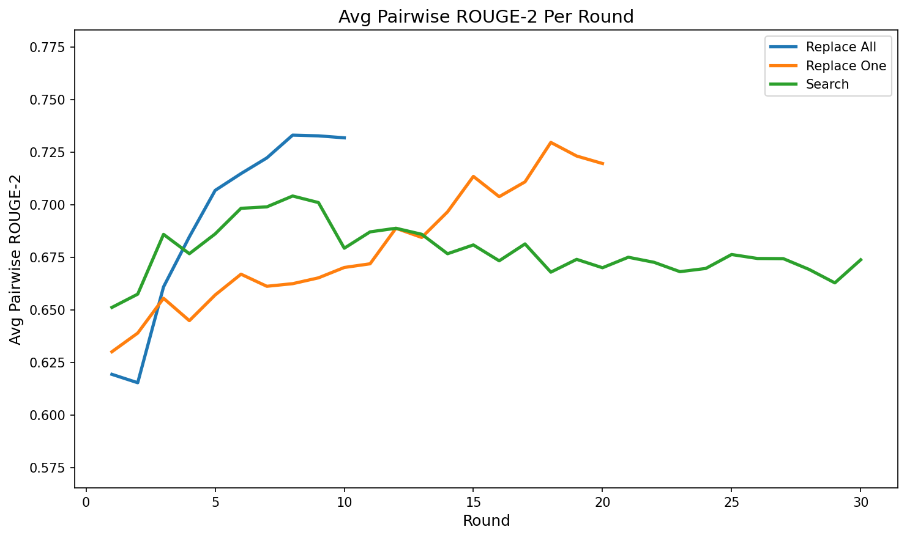
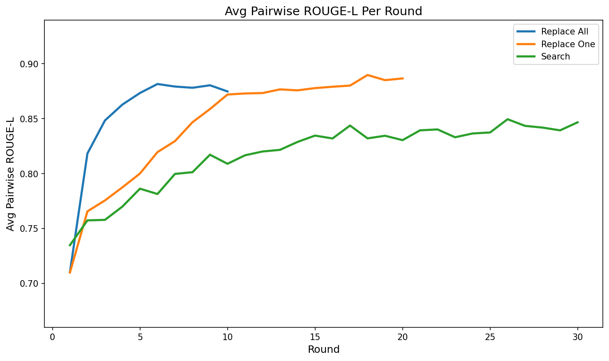

## Visualization outputs

This directory stores plots generated from:
- `evaluation_outputs/<MODEL_SUBDIR>/local_*_eval.json`
- `entity_extraction_output/<MODEL_SUBDIR>/local_*_entity_results.json`
- raw pipeline output `experiment_outputs/<MODEL_SUBDIR>/local_agentic_rag.json` (for tool-call counts)

### Notebooks

| Notebook | Produces |
|---|---|
| `visualization.ipynb` | Per-model, per-round line/bar plots for the **baseline** variants (Replace All / Replace One / Search). |
| `agentic-rag-visualization.ipynb` | Same per-round plots **including Agentic RAG**, plus a **multi-model collapse-rate bar chart** across all four models and experiment variants. |

### Directory layout

Figures are written under `visualization_outputs/<MODEL_SUBDIR>/...`, where `MODEL_SUBDIR`
matches the experiment/eval layout, e.g. `Qwen/Qwen2.5-14B-Instruct`. The multi-model chart
is written to `visualization_outputs/multi_model_collapse_rates.png`.

> Note: only `Qwen/Qwen2.5-14B-Instruct` figures are for the 400-question dataset; older
> per-model figures are from the earlier 50-question runs.

Per-model figures (one series per variant):
- `collapse_by_simulation.png`
- `unique_words_per_round.png`
- `unique_entities_per_round.png`
- `entity_similarity_per_round.png`
- `same_answer_percentage_per_round.png` (only meaningful if the same-answer judge is enabled)
- `avg_pairwise_tes_per_round.png`
- `avg_pairwise_rouge1_per_round.png`, `avg_pairwise_rouge2_per_round.png`, `avg_pairwise_rougeL_per_round.png`
- `avg_ai_reference_percentage_per_round.png` (Search & Agentic RAG only)
- `avg_tool_calls_per_round.png` (Agentic RAG only)

Variants plotted (consistent `COLORS` in the notebook):
**Replace All**, **Replace One**, **Search**, **Rerank**, **Search Paraphrase**, **Agentic RAG**.

### Regenerating plots

1. Open `agentic-rag-visualization.ipynb` (or `visualization.ipynb` for the baseline-only plots).
2. At the top, set `MODEL_SUBDIR` (e.g. `Qwen/Qwen2.5-14B-Instruct`) and confirm the input
   paths in the file dicts point at the eval/entity JSONs you want (the multi-model chart cell
   reads absolute paths from the consolidated `all_experiments/` layout — see
   [`../docs/data_locations.md`](../docs/data_locations.md)).
3. Run all cells. New PNGs are written under `visualization_outputs/<MODEL_SUBDIR>/`.

### Browse: Qwen/Qwen2.5-14B-Instruct (400-question dataset)

- Collapse by simulation — 
- Unique words per round — 
- Unique entities per round — 
- Entity similarity per round — 
- Same-answer percentage per round — 
- Avg TES per round — 
- Avg ROUGE-1 per round — 
- Avg ROUGE-2 per round — 
- Avg ROUGE-L per round — 
